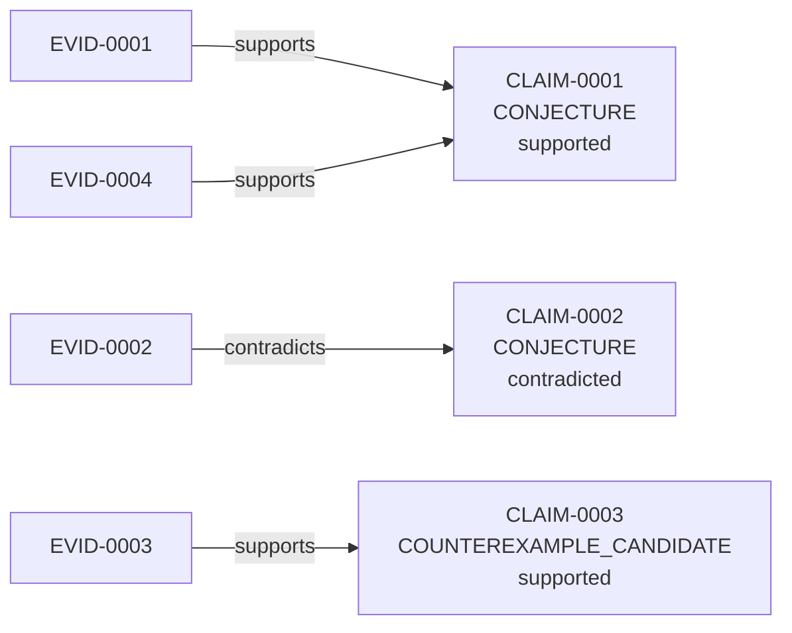

# PROBLEM-0001 — Diminishing returns of the nuclear Nystrom error for SDDM/SDD matrices

> Auto-generated from local artifacts. Evidence is not proof.

## Status Summary

- **Status:** EXPERIMENTAL_ONLY — Experiments ran and produced results, but no proof sketch or theorem builds on them yet; results are evidence, not proof.
- **Verified theorems:** none — no theorem has reached a verified status
- **Heuristics / sketches:** none recorded
- **Experiments run:** 4 executed, 0 planned
- **Main gaps:** none explicitly recorded
- **Referee verdict:** block (REFEREE-0001)
- **Recommended next step:** Verify or refute the 1 counterexample candidate(s) with an explicit verification artifact before calling them counterexamples.

## Summary

**Status:** open — open.

- **Claims:** 3 (2 CONJECTURE, 1 COUNTEREXAMPLE_CANDIDATE).
- **Verified results:** none — nothing has reached a verified status.
- **Experiments:** 4 reproducible run(s).
- **Proof attempts:** 0 verified, 0 sketch(es).
- **Failed attempts:** 2 recorded.
- **Contradictions:** 1 claim(s) have contradicting evidence (CLAIM-0002); review.
- **Strongest support:** CLAIM-0001 has the most supporting evidence (2 item(s)).

_Evidence here supports claims but does not verify them; only a verified proof or verification artifact settles a claim._

## Problem

Let L be symmetric positive-definite and K = (L + gamma*I)^{-1} in the limit gamma -> 0+ (for positive-definite L this equals L^{-1}). For a non-empty index set I, let f(I) = ||K - K[:,I] K[I,I]^{-1} K[I,:]||_* be the nuclear-norm Nystrom error (the residual is PSD, so this equals tr(K) - tr(K[:,I] K[I,I]^{-1} K[I,:])). The property in question is diminishing error-reduction: for all non-empty S subset of T and i not in T, f(S u {i}) - f(S) <= f(T u {i}) - f(T). For inverse graph Laplacians this property underlies a greedy-vs-optimal bound decaying like e^{-k/s} for k >= s. Open question: does the property hold when L is (1) a symmetric diagonally dominant M-matrix (SDDM), positive-definite, or (2) symmetric diagonally dominant (SDD), positive-definite? Convention note: under the literal reading 'f is submodular' (>= instead of <=), the property fails on random inverse-Laplacian instances (47/48 exact checks, EXP-0004), contradicting the cited Laplacian behavior, so the diminishing-error-reduction reading above is the one tested in this dossier. The disambiguation is empirical; no local source artifact pins the cited Laplacian result.

- **id:** PROBLEM-0001
- **domain:** numerical linear algebra
- **formalization:** informal
- **tags:** nystrom, submodularity, counterexample-search

## Current Status

**open** — open.

This problem is open. Nothing below should be read as a solution; claims carry their own epistemic status.

## Definitions and Assumptions

### Definitions

- (none)

### Assumptions

- (none)

## Known Results

_Only results backed by a local source artifact._

- (none)

## Claims and Evidence

### CLAIM-0001 — conjecture (open, unproven)

- **Statement:** Setting (1): for every SDDM positive-definite L, the nuclear Nystrom error of K = L^{-1} satisfies diminishing error-reduction on non-empty nested index sets: f(S u {i}) - f(S) <= f(T u {i}) - f(T) for all non-empty S subset of T, i not in T.
- **Type:** CONJECTURE
- **Status:** supported
- **Evidence strength:** 2 supporting, 0 contradicting
- **Evidence:**
  - EVID-0001 [EXPERIMENT, supports] (support only — never a proof): EXP-0001: 0/90 exact-arithmetic violations of diminishing error-reduction across 15 random SDDM-PD matrices (n=6, seed 7). Supports setting (1) on these instances; it does not verify the general statement.
  - EVID-0004 [COMPUTATION, supports] (support only — never a proof): EXP-0004: on the cited known case (inverse graph Laplacians, gamma=1/1000), the diminishing error-reduction reading holds in 48/48 exact checks while the literal 'f is submodular' reading fails in 47/48 — the tested convention matches the known case on these instances.
- **To settle:** Open: experiments and sketches can support but never verify it; only an accepted proof artifact settles it.

### CLAIM-0002 — conjecture (open, unproven)

- **Statement:** Setting (2): for every SDD positive-definite L (mixed-sign off-diagonals allowed), the nuclear Nystrom error of K = L^{-1} satisfies diminishing error-reduction on non-empty nested index sets.
- **Type:** CONJECTURE
- **Status:** contradicted
- **Evidence strength:** 0 supporting, 1 contradicting
- **Evidence:**
  - EVID-0002 [EXPERIMENT, contradicts] (support only — never a proof): EXP-0002: 4/90 strict exact-arithmetic violations across 15 random SDD-PD matrices (n=6, seed 7); the first violating instance is recorded as CLAIM-0003.
- **To settle:** Open: experiments and sketches can support but never verify it; only an accepted proof artifact settles it.

### CLAIM-0003 — counterexample candidate (UNVERIFIED)

- **Statement:** Candidate counterexample to setting (2): the 6x6 SDD positive-definite matrix L* with rows [8, 3/2, -1/4, -3/4, 1, -3/2], [3/2, 26/3, -3/2, -1/3, 4/3, 1], [-1/4, -3/2, 9/2, -1, -1/2, -1/4], [-3/4, -1/3, -1, 61/12, -3/2, 1/2], [1, 4/3, -1/2, -3/2, 28/3, -2], [-3/2, 1, -1/4, 1/2, -2, 33/4], with S={0}, T={0,3}, i=5, gives f(S u {i}) - f(S) = -207777829717/1469109624035 > -156716773/1107431115 = f(T u {i}) - f(T) in exact rational arithmetic, so the diminishing-error-reduction inequality fails on this instance. Independent confirmation of the general statement's failure still requires an external verification record.
- **Type:** COUNTEREXAMPLE_CANDIDATE
- **Status:** supported
- **Evidence strength:** 1 supporting, 0 contradicting
- **Evidence:**
  - EVID-0003 [COMPUTATION, supports] (support only — never a proof): EXP-0003: a second, independent implementation (pure-Python fractions, Gauss-Jordan, no sympy) reproduces both marginals exactly and confirms the strict inequality; the instance is confirmed symmetric, strictly diagonally dominant, positive-definite (leading principal minors positive, exact).
- **To settle:** Link a verification artifact (a verified proof attempt or verification-grade evidence such as FORMAL_PROOF), then promote it — until then it stays a candidate.

## Epistemic Map

## Experiments

_Reproducible runs. Each is evidence, not proof — cite the EXP-* id._

- EXP-0001 [succeeded]: SDDM sweep: 90 nested-pair checks, exact rationals — `python3 scripts/check_nystrom_submodularity.py --cls sddm --n 6 --trials 15 --pairs 6 --seed 7` (seed=7); exit=0; stdout 192 chars, stderr 0 chars.
- EXP-0002 [succeeded]: SDD sweep: 90 nested-pair checks, exact rationals — `python3 scripts/check_nystrom_submodularity.py --cls sdd --n 6 --trials 15 --pairs 6 --seed 7` (seed=7); exit=0; stdout 1824 chars, stderr 0 chars.
- EXP-0003 [succeeded]: Independent exact re-verification of the candidate instance (pure-fraction Gauss-Jordan, stdlib only) — `python3 scripts/verify_instance.py` (seed=None); exit=0; stdout 378 chars, stderr 0 chars.
- EXP-0004 [succeeded]: Convention check on the known inverse-Laplacian case — `python3 scripts/convention_check_laplacian.py` (seed=11); exit=0; stdout 219 chars, stderr 0 chars.

## Proof Attempts

### Verified proofs

- (none)

### Proof sketches (NOT machine-checked)

#### Primary answer (dossier problem)

- (none)

## Failed Attempts

_First-class artifacts. Do not retry these without a new assumption._

- FAILED-0001: Tested the inequality on the SDD/SDDM matrix L itself instead of K = (L + gamma*I)^{-1} — Mis-formalization: exact checks showed violations in both inequality directions on both matrix classes, inconsistent with the cited Laplacian behavior; the problem statement concerns the inverse. Results discarded. [reusable obstruction]
- FAILED-0002: Literal reading 'the error f is submodular' (f(S u {i}) - f(S) >= f(T u {i}) - f(T)) — Fails on the known inverse-Laplacian case in exact checks (47/48, EXP-0004), so it is unlikely to be the intended property; this dossier tests the diminishing error-reduction reading instead, which holds 48/48 there. The disambiguation is empirical — no local source artifact pins the cited Laplacian result. [reusable obstruction]

## Counterexample Search

- CLAIM-0003 [candidate, UNVERIFIED]: Candidate counterexample to setting (2): the 6x6 SDD positive-definite matrix L* with rows [8, 3/2, -1/4, -3/4, 1, -3/2], [3/2, 26/3, -3/2, -1/3, 4/3, 1], [-1/4, -3/2, 9/2, -1, -1/2, -1/4], [-3/4, -1/3, -1, 61/12, -3/2, 1/2], [1, 4/3, -1/2, -3/2, 28/3, -2], [-3/2, 1, -1/4, 1/2, -2, 33/4], with S={0}, T={0,3}, i=5, gives f(S u {i}) - f(S) = -207777829717/1469109624035 > -156716773/1107431115 = f(T u {i}) - f(T) in exact rational arithmetic, so the diminishing-error-reduction inequality fails on this instance. Independent confirmation of the general statement's failure still requires an external verification record.

## Status Changelog

- 2026-07-04 · CLAIM-0001: unverified → supported via EVID-0001 — evidence EVID-0001 (supports)
- 2026-07-04 · CLAIM-0002: unverified → contradicted via EVID-0002 — evidence EVID-0002 (contradicts)
- 2026-07-04 · CLAIM-0003: unverified → supported via EVID-0003 — evidence EVID-0003 (supports)

## Next Actions

- Verify or refute the 1 counterexample candidate(s) with an explicit verification artifact before calling them counterexamples.
- Consider a formalization_attempt to make definitions proof-assistant ready.

## Honesty Warnings

- None. Report language matches the dossier's artifacts.
